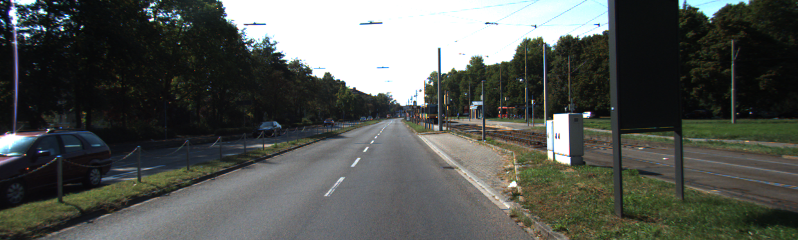
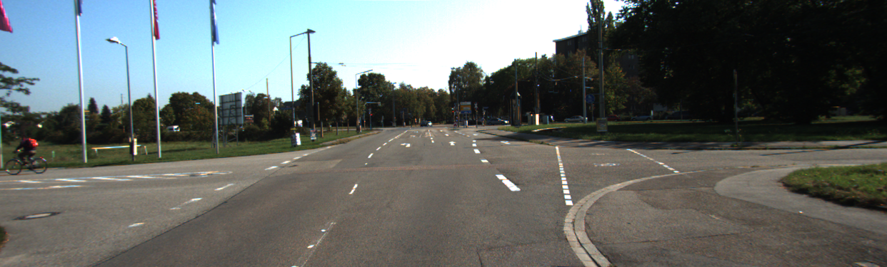

# Semantic Segmentation Project Starter Code
Self-Driving Car Engineer Nanodegree Program

In this project I will train a FCN for Semantic Segmentation. 

The goals / steps of this project are the following:

* 1.Project introduction.
* 2.Does the project load the pretrained vgg model?
* 3.Does the project learn the correct features from the images?
* 4.Does the project optimize the neural network?
* 5.Does the project train the neural network?
* 6.Does the project train the model correctly?
* 7.Does the project use reasonable hyperparameters?
* 8.Does the project correctly label the road?

 

  
### [Rubric](https://review.udacity.com/#!/rubrics/989/view) Points
### Here I will consider the rubric points individually and describe how I addressed each point in my implementation.  
  
#### 1.Project introduction.
Data prepare:  
Data: Download Kitti Road dataset from [here](https://s3-us-west-1.amazonaws.com/udacity-selfdrivingcar/advanced_deep_learning/data_road.zip), then put them into data directory by pathtree.  
Model:  [VGG16](https://s3-us-west-1.amazonaws.com/udacity-selfdrivingcar/vgg.zip)  
If VGG data does not exist, the implementation of main.py will download automatically.
  
Project data path tree:
<div class="test">

</div>

   
Project Graph:
<div class="test">

</div>
  
   
I implement project by following instructions:
```
python3 main.py
```
  
  
#### 2.Does the project load the pretrained vgg model?
The function load_vgg is implemented correctly, code segment:
```
    vgg_tag = 'vgg16'
    vgg = tf.saved_model.loader.load(sess, [vgg_tag], vgg_path)
    vgg_input_tensor_name = sess.graph.get_tensor_by_name('image_input:0')
    vgg_keep_prob_tensor_name = sess.graph.get_tensor_by_name('keep_prob:0')
    vgg_layer3_out_tensor_name = sess.graph.get_tensor_by_name('layer3_out:0')
    vgg_layer4_out_tensor_name = sess.graph.get_tensor_by_name('layer4_out:0')
    vgg_layer7_out_tensor_name = sess.graph.get_tensor_by_name('layer7_out:0')
```
  
  
#### 3.Does the project learn the correct features from the images?
The function layers is implemented correctly, code segment:
```
    pool3_out_scaled = tf.multiply(vgg_layer3_out, 0.0001, name= 'pool3_out_scaled')
    pool4_out_scaled = tf.multiply(vgg_layer4_out, 0.01, name='pool4_out_scaled')
    
    output_3 = tf.layers.conv2d(pool3_out_scaled, int(4096 / 8), 1, padding = 'same', name = "output_3")
    output_4 = tf.layers.conv2d(pool4_out_scaled, int(4096 / 2), 1, padding = 'same', name = "output_4")

    output_7_01 = tf.layers.conv2d_transpose(vgg_layer7_out, int(4096 / 2), 4, (2, 2), padding = 'same', kernel_regularizer = tf.contrib.layers.l2_regularizer(reg_scale), name = 'output_7_01')
    conv_output_7_01 = tf.layers.conv2d(output_7_01, int(4096 / 2), 1, padding = 'same', kernel_regularizer = tf.contrib.layers.l2_regularizer(reg_scale), name = "conv_output_7_01")
    add_conv_output_7_01 = tf.add(output_4, conv_output_7_01, name = "add_conv_output_7_01")

    output_7_02 = tf.layers.conv2d_transpose(add_conv_output_7_01, int(4096 / 8), 4, (2, 2), padding = 'same', kernel_regularizer = tf.contrib.layers.l2_regularizer(reg_scale), name = 'output_7_02')
    conv_output_7_02 = tf.layers.conv2d(output_7_02, int(4096 / 8), 1, padding = 'same', kernel_regularizer = tf.contrib.layers.l2_regularizer(reg_scale), name = "conv_output_7_02")
    add_conv_output_7_02 = tf.add(output_3, conv_output_7_02, name = "add_conv_output_7_02")

    output_7_03 = tf.layers.conv2d_transpose(add_conv_output_7_02, int(4096 / 64), 4, (2, 2), padding = 'same', kernel_regularizer = tf.contrib.layers.l2_regularizer(reg_scale), name = 'output_7_03')
    conv_output_7_03 = tf.layers.conv2d(output_7_03, int(4096 / 16), 1, padding = 'same', kernel_regularizer = tf.contrib.layers.l2_regularizer(reg_scale), name = "conv_output_7_03")

    output_7_04 = tf.layers.conv2d_transpose(conv_output_7_03, int(4096 / 128) , 4, (2, 2), padding = 'same', kernel_regularizer = tf.contrib.layers.l2_regularizer(reg_scale), name = 'output_7_04')
    conv_output_7_04 = tf.layers.conv2d(output_7_04, int(4096 / 128), 1, padding = 'same', kernel_regularizer = tf.contrib.layers.l2_regularizer(reg_scale), name = "add_conv_output_7_03")

    output_7_05 = tf.layers.conv2d_transpose(conv_output_7_04, num_classes, 4, (2, 2), padding = 'same', kernel_regularizer = tf.contrib.layers.l2_regularizer(reg_scale), name = 'output_7_05')

```
  
  
#### 4.Does the project optimize the neural network?
The function optimize is implemented correctly, code segment:
```
    logits = tf.reshape(nn_last_layer, (-1, num_classes), name = "logits")
    cross_entropy_loss = tf.reduce_mean(tf.nn.softmax_cross_entropy_with_logits(logits = logits, labels = correct_label), name = "cross_entropy_loss")
    train_op = tf.train.AdamOptimizer(learning_rate).minimize(cross_entropy_loss)
``` 
  
  
#### 5.Does the project train the neural network?
The function train_nn is implemented correctly. The screenshot of loss:
 <div class="test">

</div>
  
  
#### 6.Does the project train the model correctly?
A image for the model decreases loss:
 <div class="test">

</div>
   
  
#### 7.Does the project use reasonable hyperparameters?
Hyperparameters:
```
    batch_size = 10
    learning_rate = 1e-6
    epochs = 32
```
  
  
#### 8.Does the project correctly label the road?
The training accuracy is over 90%  
The contrast between primary image and predicted image  
<div class="test">


</div>
<div class="test">


</div>
<div class="test">


</div>

